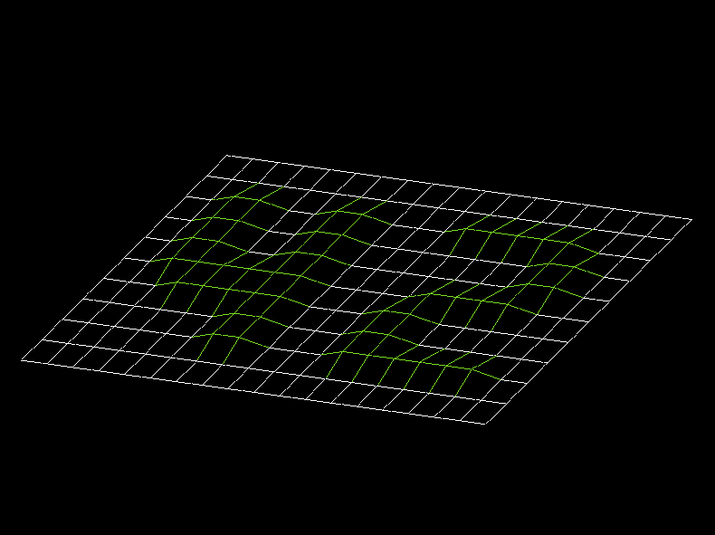

# fdf
My solution to 42's fdf project

  .
  
## Introduction
  In this project we have to build a program that recives a map in the form of a text file and draws it in the form of a wireframe map, using minilibX as a graphical engine
  The main project just asks of us to be able to open the window and draw the isometric projection. The bonus adds a lot o features, like colors, movement, diferent views, zoom adc scaling.
  
 ## Usage
  Clone the project repo and cd into it
  ```bash
  git clone https://github.com/GabrielHenaut/fdf
  cd fdf
  ```
  Compile the project using make
  ```bash
  make
  ```
  To run the program you need to provide a map, there are some already provided on the repo, but you can draw new one just following the same structure. Lines coluns represent the Y and X axies, and the numbers you use represent the Z axies.
  ```bash
  ./fdf path_to_map
  ```
  To run the bonus, that has many more features you have to compile and execute the bonus part.
  ```bash
  make bonus
  ./fdf_bonus path_to_map
  ```
  To control the bonus, use the keyboard
  | Key         | Action                         |
  | ----------- | ------------------------------ |
  | i           | Change to isometric view       |
  | p           | Change to panoramic view       |
  | arrow down  | lower y angle                  |
  | arrow left  | lower x angle                  |
  | arrow up    | increase y angle               |
  | arrow right | increase y angle               |
  | ,           | lower z angle                  |
  | .           | increase z anglet              |
  | w           | move wireframe up              |
  | a           | move wireframe left            |
  | s           | move wireframe down            |
  | d           | move wireframe right           |
  | z           | increase zoom                  |
  | x           | lower zoom                     |
  | c           | lower map scale                |
  | v           | increase mapo scale            |
  | 1           | Change color                   |
  | 2           | Change color                   |
  | 3           | Change color                   |
  
